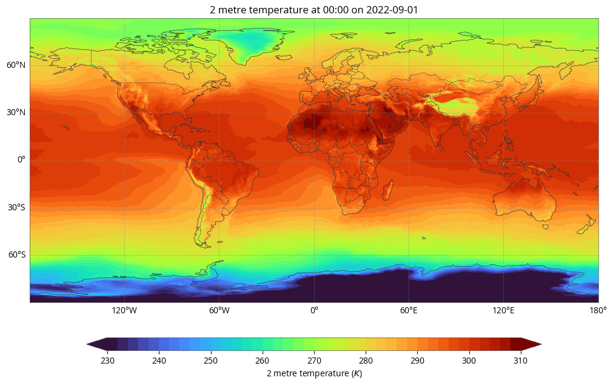

Welcome to the earthkit-maps documentation
======================================================

.. warning::

    This project is in the **BETA** stage of development. Please be aware that interfaces and functionality may change as the project develops. If this software is to be used in operational systems you are **strongly advised to use a released tag in your system configuration**, and you should be willing to accept incoming changes and bug fixes that require adaptations on your part. ECMWF **does use** this software in operations and abides by the same caveats.

**earthkit-maps** is a Python package for producing publication-quality weather
and climate maps using a simple API and a convenient library of templates.

**earthkit-maps** makes it possible to generate automatic geospatial
visualisations driven by an understanding of common weather and climate science
metadata standards.

.. code-block:: python

    earthkit.maps.quickplot(data)

**earthkit-maps** also provides deep levels of customisation to tailor
visualisations to suit your needs.

.. toctree::
   :maxdepth: 1
   :caption: Documentation

   _api/index

.. toctree::
   :maxdepth: 1
   :caption: Examples
   :titlesonly:

   user-guide
   examples/gallery/gallery.ipynb

.. toctree::
   :maxdepth: 1
   :caption: Installation

   install
   development
   licence
